# 90 Days Challenge — Engineering Case Study

> Pre-launch full-stack fitness platform built with an AI-assisted engineering workflow.

## Overview

**90 Days Challenge** is a pre-launch full-stack fitness platform built around a structured 90-day training program.

The product combines account and program-access management, onboarding, workout-related functionality, payments, and an AI fitness assistant in a single web application.

I use this project as a real product-delivery environment rather than a standalone coding exercise: requirements evolve with the product, integrations have failure cases, and changes are reviewed against existing business rules, tests, and database state.

The main application source repository remains private. This case study focuses on the product experience, architecture, engineering decisions, testing evidence and selected implementation boundaries without publishing the full commercial codebase.

## Product

The platform is being developed for a fitness coach with an existing audience and is planned as a paid digital product.

Current and implemented areas include:

- account authentication, sessions and email verification
- onboarding and program access
- Przelewy24 checkout and payment processing architecture
- program enrollment and access lifecycle
- training interface and calendar prototype
- workout-execution backend APIs
- Fitti, an OpenAI-powered fitness assistant
- responsive dashboard and profile/account management

The project is still **pre-launch**. Some areas are fully implemented and tested, while others, including the final workout frontend integration and real Przelewy24 sandbox validation, remain in progress.

## My Role

**Co-Founder & Product Developer**

I own the technical side of the product, including:

- translating product requirements into implementation tasks
- frontend and backend architecture
- API and database design
- third-party integrations
- authentication and access flows
- payment reliability and failure handling
- automated testing and CI checks
- reviewing and accepting AI-generated implementation work

I develop the product using an **AI-assisted engineering workflow**. Coding agents are used extensively for implementation, refactoring, testing and repository analysis, while I define constraints, break work into stages, review behaviour and architecture, challenge risky assumptions, require regression tests, and decide what is ready to merge.

The training content and coaching expertise are provided by my project partner; I am responsible for the software product and its technical delivery.

## Architecture

The application is split into a Next.js frontend, a FastAPI backend, and PostgreSQL as the main source of persistent application state.

The backend owns authentication, program access, enrollments, checkout/payment state and workout-execution APIs. The frontend consumes those backend states rather than deciding access or payment status independently.

Fitti is intentionally separate from the FastAPI domain backend: its current OpenAI integration runs through a Next.js server route and is limited to fitness guidance plus a small, explicit map of the current application UI.

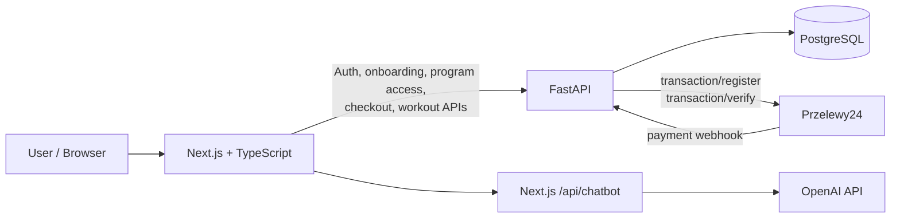

### Architectural boundaries

- **PostgreSQL-backed backend state is authoritative** for account, enrollment, access and payment decisions.
- **External network calls are kept outside open database transactions** where the payment flow requires it.
- **Przelewy24 is isolated behind a provider abstraction**, allowing automated tests to use fake/mock transports.
- **Fitti does not receive private account or enrollment state yet** and therefore must not guess user-specific values.
- The polished daily training/calendar interface currently remains a **pre-launch UI prototype** until its final connection to the workout-execution backend is completed.

## Product Experience

### Landing Page

The public-facing landing page introduces the 90-day fitness program and provides access to the participant area.

The product is still pre-launch, so the case study does not present placeholder marketing numbers as real traction or conversion data.

### Onboarding

The onboarding flow collects the information needed to prepare the user's program experience through a guided multi-step interface.

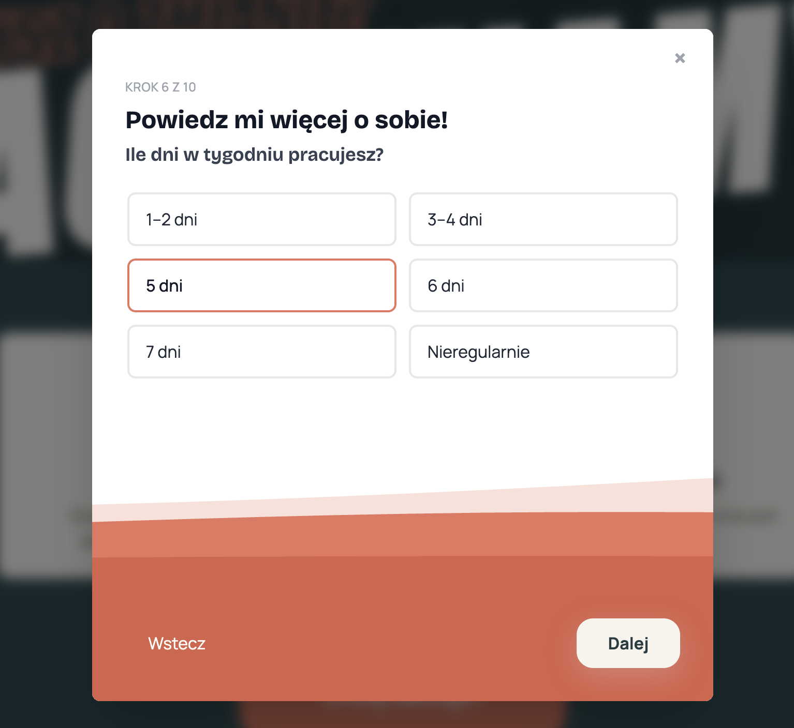

### Training Experience

The daily training and calendar interface is currently a **pre-launch UI prototype**.

It demonstrates the intended training experience, including today's workout, progress, workout continuation and a visual training calendar. The production Training route currently remains limited to authoritative program/access state until the workout-execution frontend is connected to the existing backend APIs.

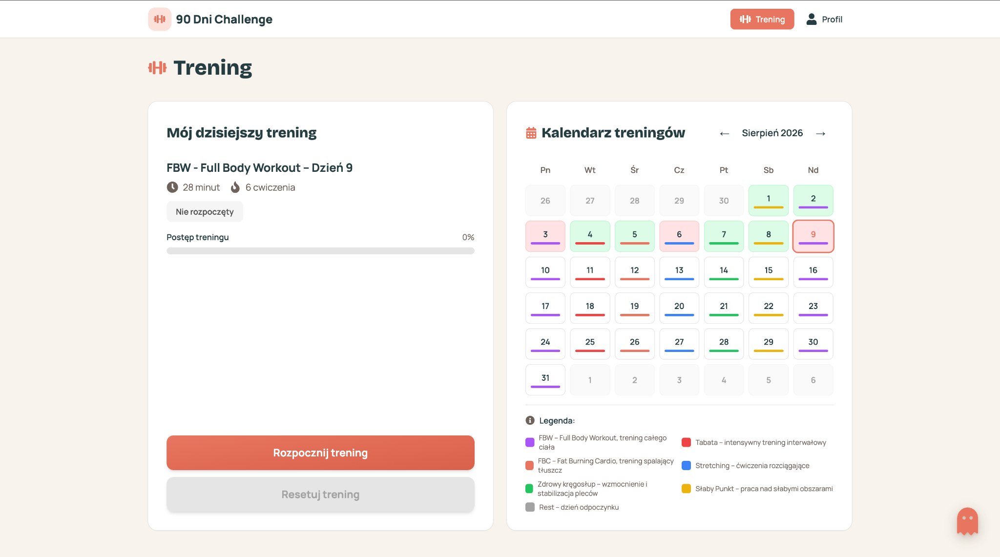

### Profile & Account Management

The Profile area combines account information, current program/access details and security actions.

Account and program state come from the application's real backend data flow. Email verification, password changes, session management and logout use the existing authentication/account mechanisms rather than screenshot-only frontend state.

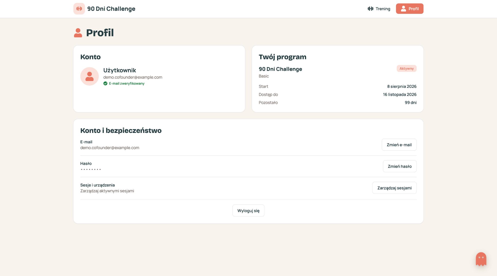

### Fitti AI Assistant

Fitti is an OpenAI-powered fitness assistant embedded in the dashboard.

It handles fitness, training, nutrition and recovery questions within defined safety boundaries. It also has a small explicit map of the current application UI for deterministic product guidance such as locating account, password, package and logout controls.

Fitti does **not** currently receive private account or enrollment state. When asked for user-specific values such as remaining access time, it explicitly redirects the user to the relevant application section instead of guessing.

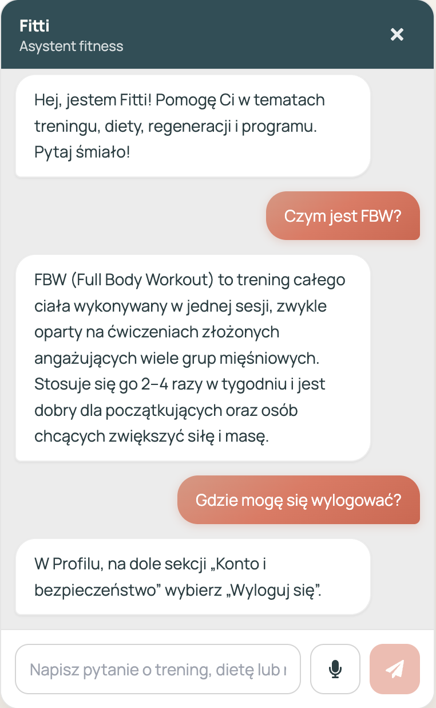

## Engineering Deep Dive: Reliable Payment Flow

One of the more demanding parts of the project is the Przelewy24 payment flow.

The interesting problem is not simply sending a request to a payment provider. The backend also has to behave correctly when requests are retried, arrive concurrently, time out at uncertain moments, or when the provider sends duplicate webhook notifications.

### The Problem

A payment flow cannot safely assume that one button click produces exactly one HTTP request.

A user may retry after a timeout, the browser may repeat a request, or two requests carrying the same idempotency key may reach the backend concurrently.

At the same time:

- product and price must remain backend-authoritative
- duplicate requests must not create duplicate logical orders
- the same idempotency key must not be reusable for a different purchase intent
- external provider calls should not keep database transactions open
- duplicate webhooks must not create duplicate program access

### Checkout & Idempotency

Each checkout request includes an `Idempotency-Key`.

The backend combines that key with a SHA-256 hash of the checkout intent:

- operation
- user
- product
- price

The hash is persisted with the order.

This allows the backend to distinguish two cases:

**Same key, same intent**

The existing canonical checkout result is replayed instead of creating another logical order.

**Same key, different intent**

The request is rejected with an `IDEMPOTENCY_KEY_REUSED` conflict rather than silently associating one key with multiple purchases.

The pending local `Order` and `Payment` are persisted before the external Przelewy24 registration request is performed.

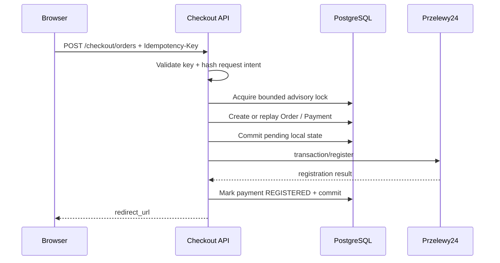

### Concurrency Control

Concurrent checkout requests using the same user and idempotency key are serialized with a PostgreSQL advisory lock.

The lock acquisition is bounded with a database `lock_timeout` rather than waiting indefinitely.

The database also keeps a unique constraint on the user/idempotency-key pair as a second line of defence.

The intended invariant is:

> concurrent retries for the same checkout intent produce one logical order, one payment and one provider registration.

Uncertain provider-registration outcomes are surfaced explicitly instead of pretending that the backend knows whether the provider accepted the request.

### Webhook Processing

Przelewy24 payment confirmation arrives through a public webhook endpoint.

The backend:

1. validates the incoming notification data and signature
2. persists or re-reads the webhook event
3. closes the current database transaction
4. calls Przelewy24 `transaction/verify`
5. performs a fresh locked read of the authoritative payment/order/event state
6. applies the verified payment transition and program fulfillment atomically

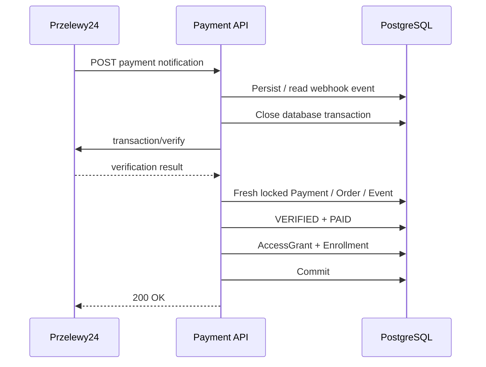

### Transaction Boundaries

A deliberate rule in this flow is:

> do not hold an open database transaction while waiting for external network I/O.

An existing or concurrently-created webhook event can start an implicit read transaction. That transaction is explicitly closed before provider verification.

After the external call, the service does not rely on potentially stale ORM objects. It performs a fresh locked read before applying the final state transition.

This keeps the external provider interaction separate from the authoritative database mutation.

The guarantees are intentionally different on each side:

- **external provider verification:** at-least-once
- **local fulfillment:** atomic and idempotent

The system does not claim exactly-once communication with Przelewy24.

### Testing the Failure Cases

The most important payment tests use real PostgreSQL concurrency rather than only mocked unit behaviour.

Examples include:

- two concurrent checkout requests with the same idempotency key resulting in one logical order, one payment and one provider registration
- conflicting reuse of an idempotency key being rejected
- bounded advisory-lock timeout behaviour
- parallel webhook notifications producing one local paid/verified transition
- one `AccessGrant` and one `Enrollment` after concurrent webhook processing
- verification calls being executed without an open database transaction
- duplicate processing preserving the original payment/verification timestamps

Przelewy24 itself is abstracted behind a payment-provider interface, so automated tests use fake providers or mocked HTTP transport rather than the real network.

> **Current boundary:** the architecture and failure/concurrency behaviour are implemented and tested, but real end-to-end Przelewy24 sandbox validation, production reconciliation/monitoring and automated recovery of uncertain payment states remain future work.

## AI-Assisted Engineering Workflow

AI coding agents are part of my normal development workflow, but they are not treated as the source of product or architectural truth.

I use them primarily for scoped implementation, refactoring, test generation and repository inspection. I remain responsible for defining the task, setting constraints, evaluating the result and deciding whether a change is ready to merge.

### How I Work With Coding Agents

A typical change follows this pattern:

1. **Inspect before editing**
   The agent first reviews the relevant code, migrations, tests and repository state.

2. **Define a narrow scope**
   I specify what may change, what must remain untouched and which business or architectural constraints must be preserved.

3. **Implement in a small stage**
   The agent performs the requested change without broadening the task into unrelated cleanup.

4. **Run verification**
   Focused tests are followed by the broader quality checks appropriate to the change.

5. **Review the result**
   I inspect the behaviour and use a separate review pass for changes involving higher-risk areas such as authentication, payments, concurrency or transaction boundaries.

6. **Require corrections before merge**
   Review findings are turned into concrete follow-up requirements and regression tests. A change is merged only after the relevant behaviour and checks are green.

This approach lets me use coding agents for implementation volume while keeping ownership of requirements, scope and acceptance.

### Human Review & Quality Control

The payment flow is a good example of this process.

The initial implementation was followed by separate review passes focused on idempotency, concurrency and transaction behaviour.

Those reviews led to additional hardening, including:

- persisting a checkout request-intent hash
- rejecting reuse of an idempotency key for a different purchase intent
- adding bounded PostgreSQL advisory-lock acquisition
- handling lock cleanup and connection invalidation safely
- closing implicit webhook database transactions before external provider verification
- refreshing stale ORM state before authoritative locked re-reads
- adding regression and concurrency tests before merge

I do not present those findings as something I manually discovered alone. The engineering ownership is in defining the constraints, deciding which review findings require action, directing the revision and accepting the change only after the implementation satisfies the required behaviour.

### Source-of-Truth Rules

The repository contains explicit operating rules for coding agents.

They define which project artifacts are authoritative, require inspection before implementation, protect database and transaction boundaries, prohibit rewriting historical migrations, and forbid bypassing failing tests with shortcuts such as `skip`, `xfail` or arbitrary sleeps.

The exact source-of-truth hierarchy and examples of these constraints are shown below.

### Repository Evidence

The AI workflow is backed by explicit repository instructions rather than relying only on conversational prompts.

**Agent working rules**

The repository requires agents to inspect existing code, migrations, tests and Git state before editing, keep changes narrowly scoped, preserve transaction boundaries and avoid bypassing tests.

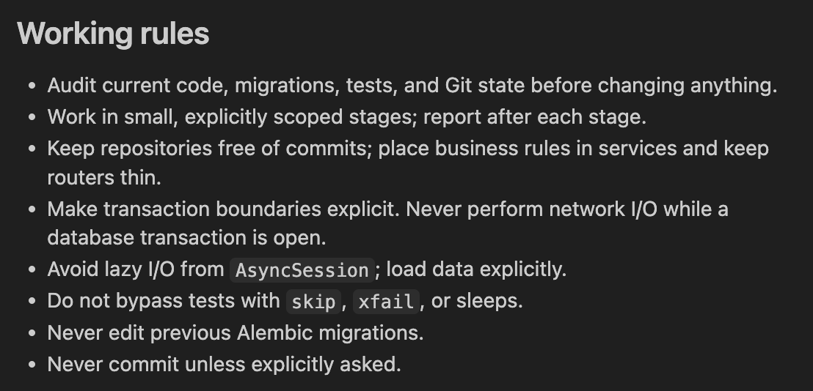

**Source-of-truth hierarchy**

When sources disagree, agents follow this order:

1. code and database migrations
2. automated tests
3. `AGENTS.md`
4. `PROJECT_PRINCIPLES.md`
5. `README`
6. the current handoff document
7. earlier reports

The screenshot below shows the original rule as maintained in the repository. The source document is written in Polish.

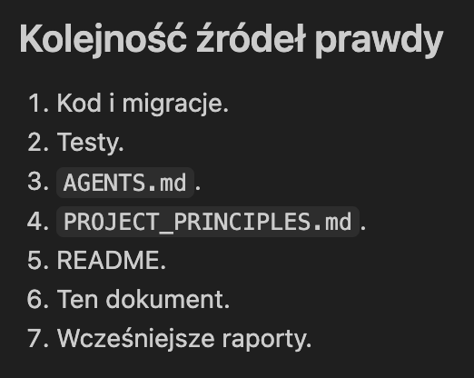

**Preserved constraints**

Individual implementation stages also carry explicit constraints defining what the agent must not infer, expose or redesign outside the requested scope.

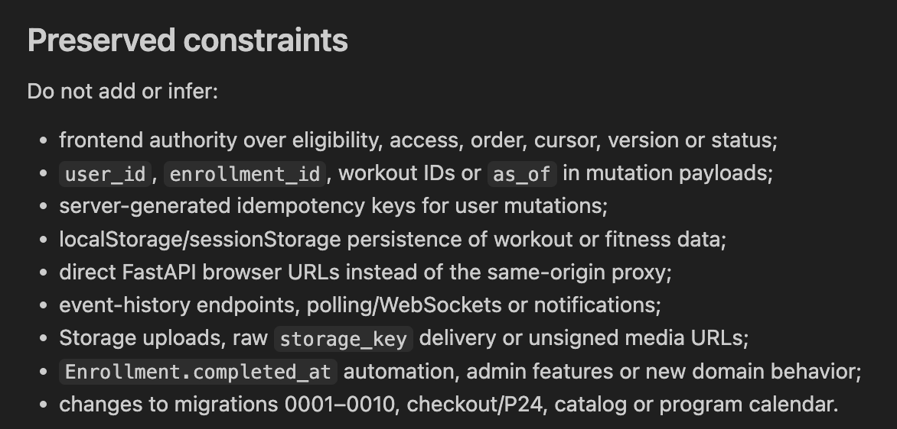

## Testing & Quality

The project uses automated verification at several levels rather than relying only on manual browser testing.

### Backend

At the latest full backend verification, the suite contained **566 passing tests**.

The suite covers areas including:

- authentication and account flows
- enrollment and program access
- checkout and payment behaviour
- webhook validation and fulfillment
- idempotency conflicts and retries
- PostgreSQL concurrency races
- transaction-boundary regressions
- workout-execution behaviour

For the concurrency-sensitive payment tests, I use a real PostgreSQL test database rather than replacing database locking behaviour with mocks.

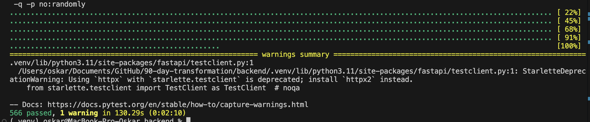

### Frontend

At the latest full frontend verification, the Vitest suite contained **191 passing tests**.

Frontend verification also includes:

- ESLint
- TypeScript type checking
- production builds
- focused regression tests for changed behaviour
- authenticated dashboard state handling
- Fitti product-awareness boundaries
- development-only Training preview isolation

### CI / Pull Request Checks

Changes are developed on scoped branches and reviewed through pull requests before merge.

GitHub Actions provides repository-level quality checks for the frontend and backend, while local focused and full-suite tests are used during implementation and review.

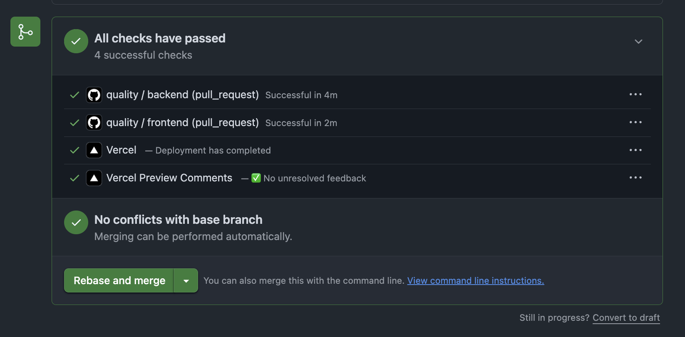

### Quality Gate Before Merge

For higher-risk changes, my merge decision typically requires:

1. focused tests for the changed behaviour
2. the relevant broader test suite
3. lint and type checking
4. a successful production build where applicable
5. `git diff --check`
6. manual verification of the user-visible behaviour
7. an additional review pass when the change involves security, payments, concurrency or transaction boundaries

The goal is not simply to maximize test count. The more important requirement is that regression tests protect the system contracts most likely to be broken by future changes or AI-generated implementation work.

## Technical Challenges

### Keeping Authority on the Backend

Access, enrollment, payment and workout state must come from authoritative backend data rather than convenient frontend assumptions.

This became particularly important while developing the Training experience. The polished workout/calendar UI remains isolated as a development-only preview until it is connected to the real workout-execution APIs, while the normal dashboard route continues to use backend-authoritative access state.

### Designing for Concurrent Requests

Checkout, payment webhooks and workout mutations cannot assume requests arrive sequentially.

Concurrency-sensitive behaviour is therefore tested against PostgreSQL using independent asynchronous sessions and real locking behaviour rather than replacing database races with mocks.

### Keeping AI Features Inside Known Boundaries

Fitti serves two different purposes:

- deterministic product guidance for known application actions
- OpenAI-backed answers for fitness-domain questions

It does not receive private dynamic account state. When a question requires authoritative user data, such as remaining access time, Fitti redirects the user to the relevant application screen rather than inventing an answer.

## Current Product Status

90 Days Challenge is currently a **pre-launch product**.

The core application architecture is already in place, but some user-facing integrations and external-provider validation are intentionally still unfinished.

| Area | Status |
| --- | --- |
| Public landing page | Implemented |
| Authentication and server-side sessions | Implemented |
| Email verification and account security flows | Implemented |
| Onboarding | Implemented |
| Backend-authoritative enrollment and access | Implemented |
| Przelewy24 checkout architecture | Implemented |
| Payment webhook verification and atomic fulfillment | Implemented and PostgreSQL-tested |
| Profile and account management UI | Implemented |
| Fitti AI fitness assistant | Implemented |
| Workout-execution backend APIs | Implemented |
| Daily Training / calendar UI | Development-only prototype |
| Production frontend integration with workout-execution APIs | In progress |
| Real Przelewy24 sandbox end-to-end validation | Pending |
| Production monitoring and payment reconciliation | Pending |

The application therefore should not be described as production-complete or already serving paying users.

## Limitations & Pending Validation

Some boundaries are intentionally explicit.

### Payments

Automated payment tests validate application behaviour using provider abstractions and mocked HTTP transport.

They cover signatures, registration behaviour, retries, idempotency, webhook processing, concurrency and fulfillment logic, but the complete flow has not yet been validated end-to-end against the real Przelewy24 sandbox.

Production-grade payment operations would also need:

- reconciliation for uncertain provider outcomes
- operational monitoring and alerting
- recovery tooling for stuck or inconsistent states
- production observability around webhook failures

### Training Experience

The backend workout-execution model exists, but the final participant-facing Training experience is not yet connected to it.

The current workout/calendar interface is therefore isolated behind a development-only preview instead of being presented as completed production functionality.

### Fitti

Fitti can answer fitness-domain questions and provide deterministic guidance about known application navigation.

It does **not** currently receive private dynamic account state such as:

- remaining program access
- the user's active package details
- current enrollment progress

When asked about those values, it redirects the user to the authoritative application UI rather than generating an answer.

## What I Would Improve Next

The next priorities are primarily about completing integration and operational readiness rather than adding more surface-level features.

### 1. Connect Training to the Workout Backend

Replace the development-only workout state with the existing backend APIs so that today's workout, exercise progress, session continuation and calendar completion are persisted authoritatively.

### 2. Complete Payment Validation and Operations

Validate the full Przelewy24 lifecycle against the real sandbox, then add the operational pieces required for production use:

- reconciliation of unresolved payments
- structured payment and webhook logging
- monitoring and alerting
- auditable recovery tooling for uncertain states

### 3. Expand Product Tooling Safely

Later iterations can add administrative tooling, content management and selected server-authoritative context for Fitti.

The same boundary would remain in place: AI may explain application state, but it should not become the authority that invents it.

## Tech Stack

### Frontend

- Next.js
- React
- TypeScript
- Tailwind CSS
- Vitest
- Testing Library
- Playwright (smoke tests)

### Backend

- Python
- FastAPI
- SQLAlchemy (async)
- PostgreSQL
- Alembic
- pytest / pytest-asyncio

### Integrations

- Przelewy24
- OpenAI API
- email delivery for authentication flows

### Engineering & Delivery

- Git / GitHub
- GitHub Actions
- Vercel
- ESLint
- TypeScript type checking
- Ruff
- mypy
- AI coding agents with repository-level operating rules
